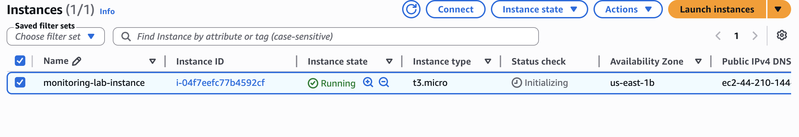
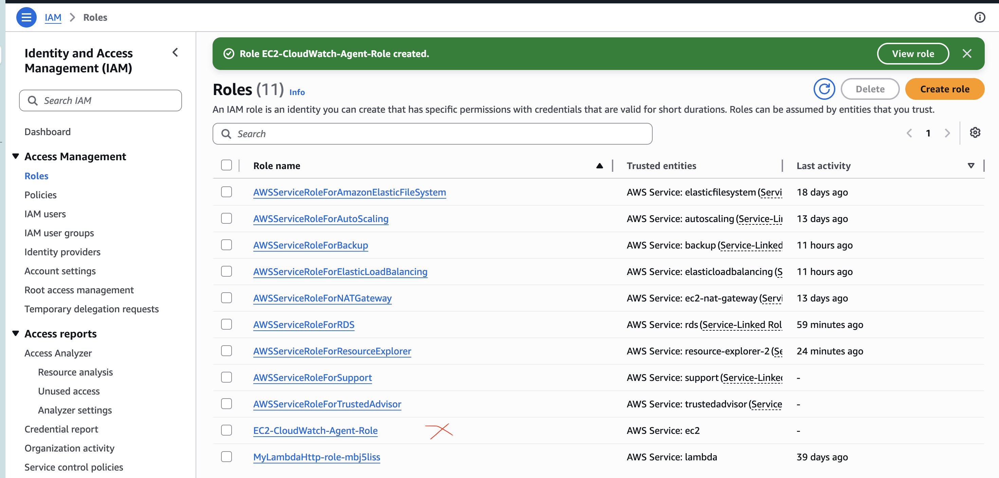
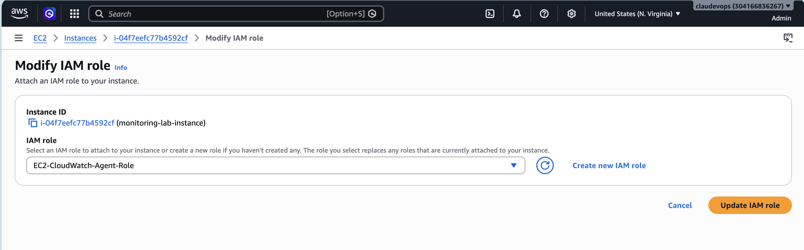
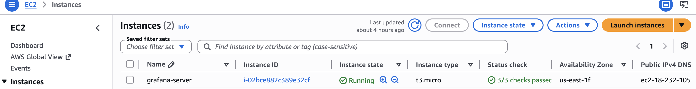
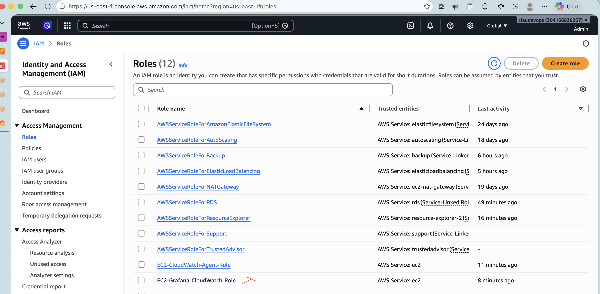

# EC2 Monitoring — CloudWatch + Grafana

## Stack technique

- **Amazon EC2** — deux instances Ubuntu : une pour l'application à monitorer, une pour Grafana
- **Amazon CloudWatch** — stockage et centralisation des métriques
- **CloudWatch Agent** — collecte des métriques custom à l'intérieur de l'instance (RAM, disque, réseau)
- **IAM Roles** — authentification sans credentials en dur
- **Grafana** — visualisation des métriques via datasource CloudWatch

## Architecture

```
EC2 (monitoring-lab-instance)
  └── CloudWatch Agent (inside-out)
        └── push métriques → Amazon CloudWatch
                                  ↑
                            query (datasource)
                                  |
                    EC2 (grafana-server) → Dashboard
```

## Étapes de construction

### 1. Instance EC2 — monitoring-lab-instance

Dans le service EC2, je lance une instance Ubuntu Server 22.04 de type t3.micro nommée `monitoring-lab-instance`. Le Security Group autorise SSH (port 22) et HTTP (port 80). Cette instance héberge l'application et le CloudWatch Agent chargé de collecter les métriques.



### 2. IAM Role — EC2-CloudWatch-Agent-Role

Dans IAM, je crée un rôle avec EC2 comme trusted entity. La trusted entity définit qui peut assumer le rôle — en choisissant EC2, seules les instances EC2 peuvent l'utiliser. La policy attachée est `CloudWatchAgentServerPolicy`, une policy managée AWS qui couvre toutes les permissions nécessaires à l'agent et se met à jour automatiquement si AWS ajoute de nouvelles fonctionnalités. Le rôle est ensuite attaché à `monitoring-lab-instance` via Actions → Security → Modify IAM Role. Sans ce rôle, l'agent n'aurait pas l'autorisation d'envoyer des métriques vers CloudWatch.







### 3. Installation du CloudWatch Agent

Après connexion en SSH sur `monitoring-lab-instance`, je télécharge et installe l'agent :

```bash
wget https://s3.amazonaws.com/amazoncloudwatch-agent/ubuntu/amd64/latest/amazon-cloudwatch-agent.deb
sudo dpkg -i amazon-cloudwatch-agent.deb
```

L'installation crée automatiquement un utilisateur système `cwagent` dédié à l'exécution de l'agent.

### 4. Configuration de l'agent

Je lance l'assistant de configuration interactif :

```bash
sudo /opt/aws/amazon-cloudwatch-agent/bin/amazon-cloudwatch-agent-config-wizard
```

L'assistant génère un fichier `config.json` dans `/opt/aws/amazon-cloudwatch-agent/bin/`. Les métriques collectées sont CPU, mémoire (`mem_used_percent`), disque (`disk_used_percent`), et réseau. Ces métriques custom sont invisibles pour AWS sans l'agent — AWS voit l'instance de l'extérieur (outside-in), tandis que l'agent tourne à l'intérieur du système d'exploitation (inside-out) et remonte ce qu'AWS ne peut pas voir nativement, notamment la RAM.

### 5. Démarrage de l'agent

```bash
sudo /opt/aws/amazon-cloudwatch-agent/bin/amazon-cloudwatch-agent-ctl \
  -a fetch-config \
  -m ec2 \
  -c file:/opt/aws/amazon-cloudwatch-agent/bin/config.json \
  -s
```

L'agent est activé comme service systemd avec `systemctl enable`, ce qui garantit son redémarrage automatique à chaque boot de l'instance. Les métriques sont envoyées vers CloudWatch toutes les 60 secondes sous le namespace `CWAgent`.

### 6. Instance EC2 — grafana-server

Je lance une seconde instance Ubuntu Server 22.04 de type t3.micro nommée `grafana-server`. Grafana est installé sur une instance séparée pour deux raisons : éviter de polluer les métriques de l'instance à monitorer (Grafana consomme environ 400MB de RAM), et garantir la disponibilité du système de monitoring même en cas de panne de l'instance principale. Le Security Group autorise SSH (port 22) et le port 3000, port par défaut de Grafana.



### 7. Installation de Grafana

```bash
sudo apt-get install -y apt-transport-https wget gnupg
sudo mkdir -p /etc/apt/keyrings
sudo wget -O /etc/apt/keyrings/grafana.asc https://apt.grafana.com/gpg-full.key
echo "deb [signed-by=/etc/apt/keyrings/grafana.asc] https://apt.grafana.com stable main" \
  | sudo tee -a /etc/apt/sources.list.d/grafana.list
sudo apt-get update && sudo apt-get install grafana -y
sudo systemctl start grafana-server
sudo systemctl enable grafana-server
```

Grafana est accessible via `http://<PUBLIC_IP>:3000`.

### 8. IAM Role — EC2-Grafana-CloudWatch-Role

Grafana utilise AWS SDK Default pour s'authentifier — il cherche automatiquement un IAM Role attaché à l'instance via l'IMDS (Instance Metadata Service). Je crée un second rôle avec EC2 comme trusted entity et la policy `CloudWatchReadOnlyAccess`, puis je l'attache à `grafana-server`. Aucune clé d'accès n'est saisie manuellement — c'est la bonne pratique : ne jamais mettre de credentials en dur.



### 9. Datasource CloudWatch dans Grafana

Dans Grafana → Connections → Data sources → Add data source → CloudWatch :

- Authentication Provider : AWS SDK Default
- Default Region : us-east-1

Le test retourne : *"Successfully queried the CloudWatch metrics API."*

### 10. Dashboard EC2 Monitoring — Semaine 3

Je crée un dashboard avec quatre panels :

| Panel | Namespace | Metric |
|---|---|---|
| CPU Usage | AWS/EC2 | CPUUtilization |
| Memory Usage | CWAgent | mem_used_percent |
| Disk Usage | CWAgent | disk_used_percent |
| Network In/Out | AWS/EC2 | NetworkIn / NetworkOut |

Chaque panel est configuré avec `InstanceId = i-048b539f096017d7c`, période de 60 secondes, statistique Average.

## Validation

Pour valider le système de monitoring de bout en bout, je simule une charge CPU sur `monitoring-lab-instance` :

```bash
sudo apt install stress -y
stress --cpu 2 --timeout 120
```

Le pic CPU est visible dans le dashboard Grafana dans les minutes suivant le test, confirmant que la chaîne complète fonctionne : CloudWatch Agent → CloudWatch → Grafana.

## Bonnes pratiques appliquées

- Deux instances séparées : isolation entre la source de métriques et l'outil de visualisation
- IAM Roles sans credentials en dur : authentification via IMDS
- CloudWatchReadOnlyAccess pour Grafana : principe du moindre privilège
- `systemctl enable` sur les deux services : redémarrage automatique au boot

## Nettoyage des ressources

Toujours supprimer les ressources après les tests pour éviter les coûts supplémentaires : arrêter et terminer les deux instances EC2, supprimer les IAM Roles créés.

